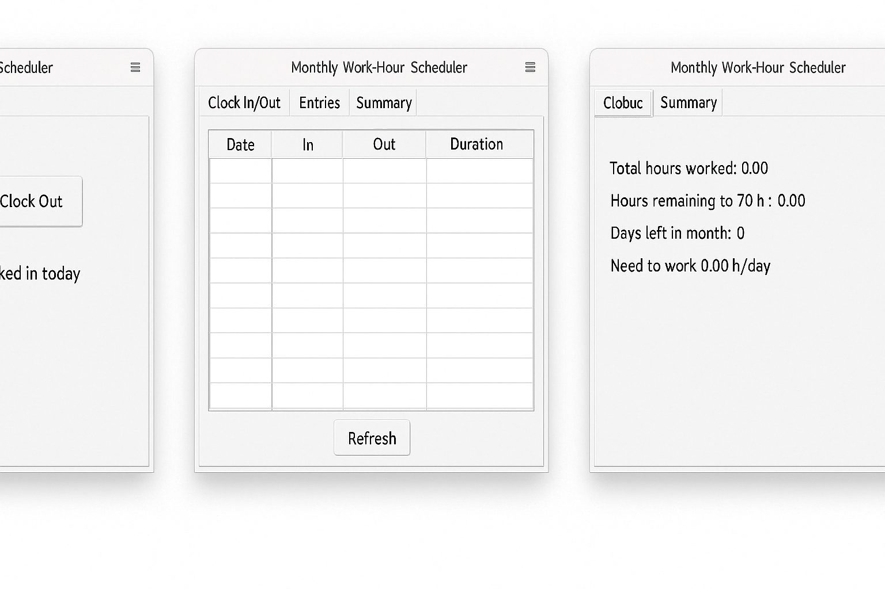

# Monthly Work‑Hour Scheduler GUI


## App UI




A Tkinter‑based desktop application to help you log your clock‑in/clock‑out times, track your monthly work hours, and calculate how many hours per day you need to work to reach a 70‑hour target each month.

---

## 📝 Features

- **Clock In / Clock Out**  
  Record your start and end times for each day with a single click.

- **Entries View**  
  See a table of all your daily entries for the current month (date, in, out, duration).

- **Summary View**  
  • Total hours worked this month  
  • Hours remaining to 70 h  
  • Days left in the month  
  • Required hours per remaining day

- **Persistence**  
  All entries are stored in an SQLite database (`work_hours.db`) so your data survives between sessions.

---

## ⚙️ Installation

1. **Clone the repository**  
   ```sh
   git clone https://github.com/yourusername/work-hour-scheduler.git
   cd work-hour-scheduler


```mermaid
classDiagram
    class DatabaseManager {
        <<Singleton>>
        - conn
        - cur
        + get_instance()
        + execute(query, params)
        + fetchall()
    }
    class TimeEntry {
        - id
        - date
        - clock_in
        - clock_out
        - duration
        + to_dict()
    }
    class TimeLogDAO {
        + create_tables()
        + add_entry(date, clock_in)
        + update_entry(date, clock_out, duration)
        + get_entries_for_month(year, month)
    }
    class TimeLogManager {
        + clock_in()
        + clock_out()
        + get_monthly_entries()
        + total_hours(entries)
    }
    class Scheduler {
        + hours_remaining(target, worked)
        + days_remaining()
        + daily_target(hours_remain, days_remain)
    }
    class MainWindow {
        + __init__()
        + refresh_all()
    }
    class ClockInOutFrame {
        + _clock_in()
        + _clock_out()
        + refresh_status()
    }
    class EntriesFrame {
        + refresh()
    }
    class SummaryFrame {
        + refresh()
    }

    TimeLogDAO --> DatabaseManager : uses
    TimeLogManager --> TimeLogDAO : uses
    MainWindow --> TimeLogManager : uses
    MainWindow --> Scheduler : uses
    ClockInOutFrame --> MainWindow : calls
    EntriesFrame --> MainWindow : calls
    SummaryFrame --> MainWindow : calls
